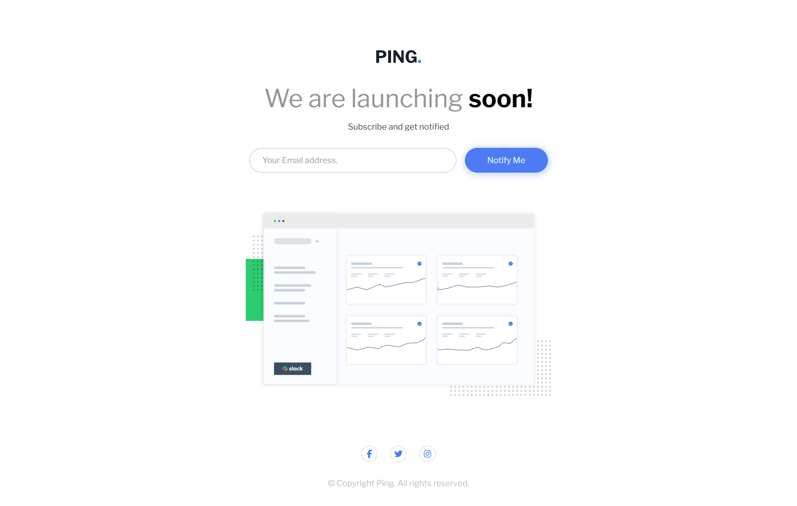
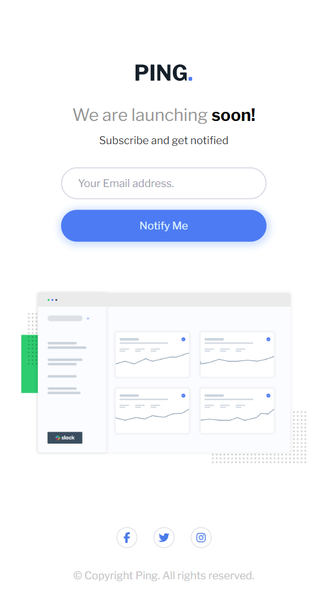

# Frontend Mentor - Ping coming soon page solution

This is a solution to the [Ping coming soon page challenge on Frontend Mentor](https://www.frontendmentor.io/challenges/ping-single-column-coming-soon-page-5cadd051fec04111f7b848da). Frontend Mentor challenges help you improve your coding skills by building realistic projects. 

### The challenge

Users should be able to:

- See hover and focus states for all interactive elements on the page

### Screenshot1

### Screenshot2

### Links

- Solution URL: [solution URL](https://github.com/IndranjanaChatterjee/Ping-single-column-coming-soon-page)
- Live Site URL: [live site URL](https://ping-single-column-coming-soon-page-ten-iota.vercel.app/)

## My process

### Built with

- Semantic HTML5 markup
- CSS custom properties
- Flexbox
- Mobile-first workflow
- [React](https://reactjs.org/) - JS library
- [Tailwind CSS](https://tailwindcss.com/)-CSS Framework# Frontend Mentor - Social links profile solution

